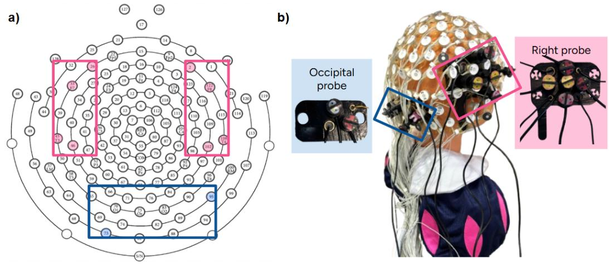
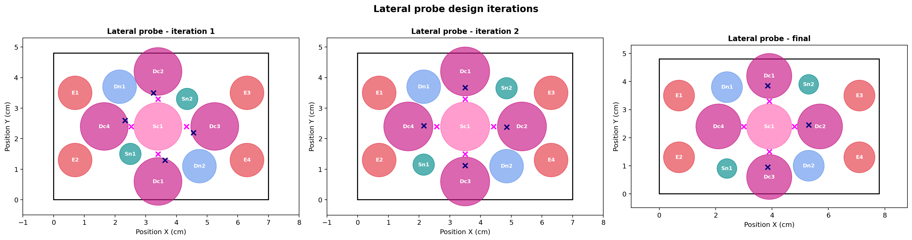
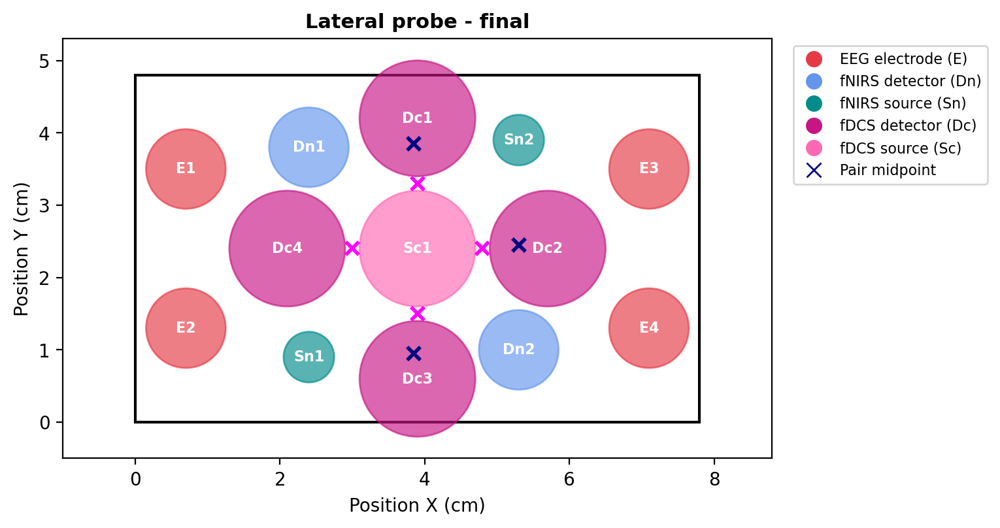
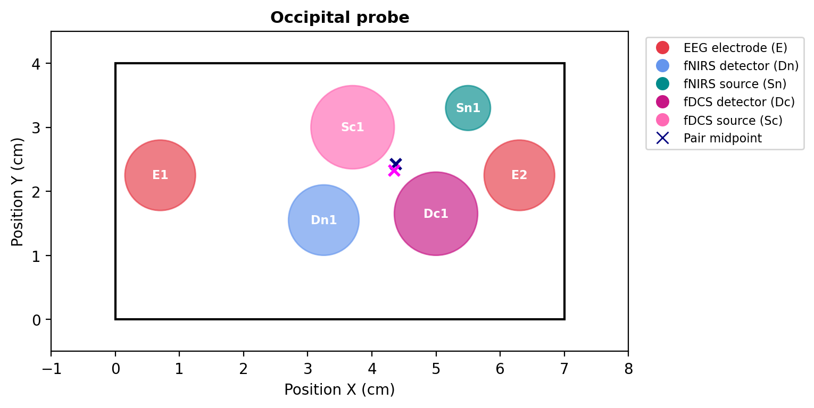
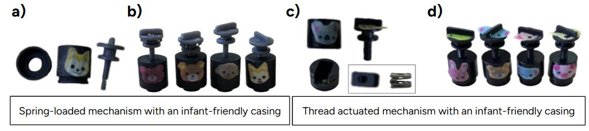
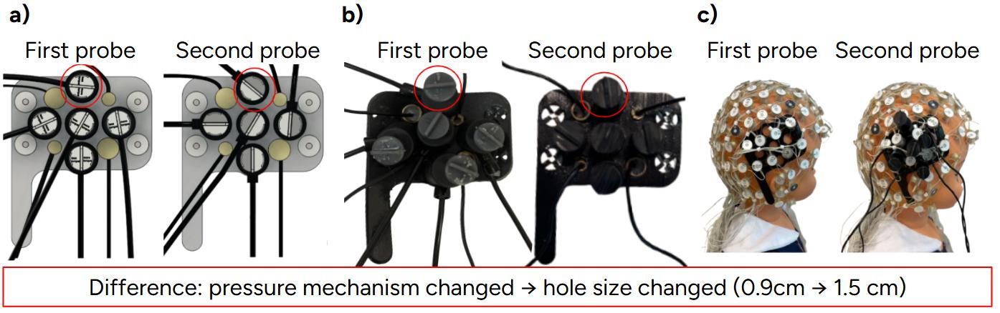
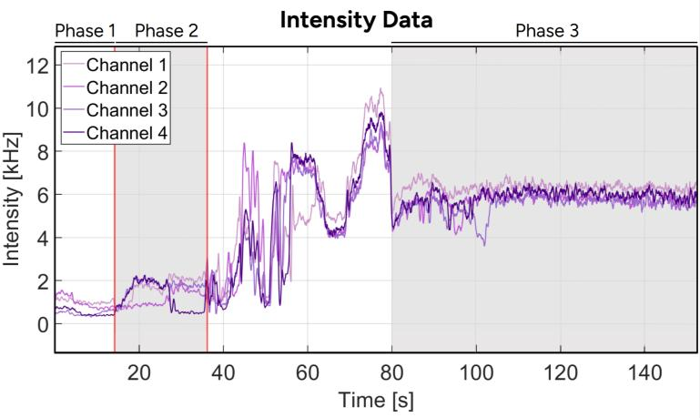

# Multimodal Probe Design for Infant Neuroimaging

**Computational design and geometric validation of head-mounted probes integrating EEG, fNIRS and fDCS, together with a mechanical pressure mechanism designed to improve optode–scalp contact through hair.**

Bachelor's Thesis in Biomedical Engineering — Universitat Pompeu Fabra, 2024/2025
Speech Acquisition & Perception Group (Center for Brain and Cognition) · Institut de Ciències Fotòniques (ICFO)

[](https://www.python.org/)
[](LICENSE)
[](https://github.com/silviiavalls/multimodal-infant-neuroimaging/actions/workflows/tests.yml)



*Final setup: 128-channel EEG layout with the temporal (pink) and occipital (blue) regions selected for probe placement, and the assembled system mounted on an infant mannequin.*

---

## The problem

Understanding how 4–5-month-old infants process speech requires measuring both **when** the brain responds (electrical activity, milliseconds) and **where** (haemodynamic response, centimetres). No single technique does both, so the study combines three:

| Technique | Measures | Strength |
|---|---|---|
| **EEG** | electrical activity of neuronal populations | temporal resolution (ms) |
| **fNIRS** | oxy- and deoxyhaemoglobin concentration | spatial resolution, oxygenation |
| **fDCS** | cerebral blood flow at the microvascular level | direct perfusion, complements fNIRS |

Combining them on an infant head is where it gets hard. Infants move constantly, cannot follow instructions, must stay on a caregiver's lap, and lose patience within minutes. And in a previous study from the same laboratory, **more than 50% of the excluded data was lost to poor optode–scalp contact caused by hair**, which substantially reduced the detected photon counts.

This thesis attacked that as an engineering problem, along three lines: reanalyse existing recordings to recover usable data, design a mechanism that improves scalp contact, and lay out a sensor distribution where all three modalities coexist without interfering.

---

## What is in this repository

The computational half of the project: **a design engine that validates and renders candidate probe layouts from defined sensor coordinates**, replacing the hand-drawing and manual distance calculations that made iteration slow. It does not search for optode positions; it takes a proposed layout and checks it against the geometric constraints before the design reaches CAD or the printer.

```
├── src/probe_design/       # geometry engine, layout model, plotting, CLI
├── configs/                # the probe-layout configurations, as data
├── scripts/                # regenerate every figure in one command
├── notebooks/              # interactive walkthrough
├── archive/                # original exploration notebook, kept unmodified
├── tests/                  # geometry and design-constraint tests
├── figures/                # generated layouts + figures from the thesis
└── docs/                   # full thesis (PDF)
```

---

## The design engine

A probe is fully described by its outline and the centre of every component. Everything else is derived: source–detector separations, which pairs are admissible, and where each pair's midpoint falls on the probe.

A source–detector pair is admissible only if it satisfies **both** conditions:

1. **Separation** falls inside the modality's window — 1.8–3.0 cm for fNIRS, 1.5–2.0 cm for fDCS. Separation sets the depth the measurement is weighted towards: shorter separations are dominated by superficial tissue, longer ones carry more weight from deeper tissue but return far fewer photons.
2. **Clearance is satisfied** — no third component sits within a small buffer of the straight line joining source and detector. This is a two-dimensional check on the probe plane, not a model of photon propagation; it catches layouts where components are packed too tightly to work.

```python
from probe_design import ProbeLayout

layout = ProbeLayout.from_json("configs/lateral_final.json")
print(layout.report())
```

```
Lateral probe - final  (7.8 x 4.8 cm)
--------------------------------------------------------
EEG           : 4 electrodes
fNIRS optodes : 2 sources, 2 detectors
fDCS optodes  : 1 source, 4 detectors

Admissible FNIRS pairs (SDS 1.8-3.0 cm, clearance satisfied): 3
   Sn1-Dn2  SDS =  2.90 cm   midpoint = (3.85, 0.95)
   Sn2-Dn1  SDS =  2.90 cm   midpoint = (3.85, 3.85)
   Sn2-Dn2  SDS =  2.90 cm   midpoint = (5.30, 2.45)

Admissible FDCS pairs (SDS 1.5-2.0 cm, clearance satisfied): 4
   Sc1-Dc1  SDS =  1.80 cm   midpoint = (3.90, 3.30)
   Sc1-Dc2  SDS =  1.80 cm   midpoint = (4.80, 2.40)
   Sc1-Dc3  SDS =  1.80 cm   midpoint = (3.90, 1.50)
   Sc1-Dc4  SDS =  1.80 cm   midpoint = (3.00, 2.40)
```

The midpoint is a coarse geometric marker for where a pair's measurement area falls on the probe, which is what relates a pair to the anatomical region the probe sits over.

### Design iterations



Three lateral probes were printed. The first was built around a spring-loaded pressure mechanism. Moving to the thread-actuated mechanism meant enlarging the fDCS openings from 0.9 cm to 1.5 cm, which drove the second layout. The second forced the optic fibres to bend, so the third was widened by 8 mm to allow straight routing without giving up temporal-lobe coverage.

| Layout | Size (cm) | EEG | fNIRS optodes | fDCS optodes |
|---|---|---|---|---|
| `lateral_v1` | 7.0 × 4.8 | 4 electrodes | 2 sources, 2 detectors | 1 source, 4 detectors |
| `lateral_v2` | 7.0 × 4.8 | 4 electrodes | 2 sources, 2 detectors | 1 source, 4 detectors |
| `lateral_final` | 7.8 × 4.8 | 4 electrodes | 2 sources, 2 detectors | 1 source, 4 detectors |
| `occipital` | 7.0 × 4.0 | 2 electrodes | 1 source, 1 detector | 1 source, 1 detector |

The occipital probe covers the control region — an area not expected to activate during language tasks in typically developing infants — and carries a low optode density by design. Its separations are matched to the lateral probe (1.80 cm fDCS, 2.90 cm fNIRS), which reduces acquisition geometry as a potential confound when the two regions are compared. A test enforces this invariant.

The physical occipital probe also carries a rectangular accelerometer, used to monitor head movement and flag motion artefacts. Its coordinates are not recorded in the source notebook, so it is not represented in the configuration here.

### Final probe layouts

| Lateral (temporal lobe, region of interest) | Occipital (control region) |
|---|---|
|  |  |

---

## The pressure mechanism



*Two mechanism families were prototyped: a spring-loaded design (a, b) and a thread-actuated design (c, d), both in infant-friendly casings.*

Hair scatters and absorbs near-infrared light before much of it reaches the scalp. Commercial holders such as the NIRx spring system offer a small set of discrete pressure levels, requiring physical part swaps to adapt to different hair types. The mechanism developed here uses a **threaded adjustment that is continuously variable**: one component covers the full range, pressure increases gradually and gently, and the black casing suppresses stray reflections.

The design went through conceptual sketches, 3D modelling in Fusion 360, resin 3D printing and CNC turning, with successive physical prototypes assessed on an infant mannequin.



*First and second printed probes: 3D design, fabricated part, and mounted on the mannequin. Moving to the thread-actuated mechanism required enlarging the optode openings from 0.9 cm to 1.5 cm.*

### Does it work?



The occipital probe was mounted over the right temporal region of a young adult volunteer with dense dark hair, using a 785 nm laser source at 19.3 mW and one source with four fDCS channels. The screws were then tightened progressively while recording intensity:

- **Phase 1** (0–14.15 s) — no pressure, optodes resting on hair: below 2 kHz, around 1 kHz, consistent with room-light contamination
- **Phase 2** (14.15–36.09 s) — source screw lowered incrementally: a modest rise
- **Transitional** (36.09–80 s) — detector screw tightened: continuous increase as contact improves; excluded from analysis as a transient
- **Phase 3** (80–150 s) — both screws fully engaged: stable at **approximately 6.5 kHz across all four channels**

The detected photon rate rises from roughly 1 kHz to roughly 6.5 kHz once pressure is applied.

---

## EEG reanalysis

The thesis also reanalysed an existing EEG/fDCS visual study in 4–5-month-old infants (5 Hz flickering checkerboard, occipital response) using the [APICE](https://github.com/neurokinder/APICE) pipeline in EEGLAB.

Many recordings had originally been discarded because a misaligned mirror made it impossible to tell which stimulus the infant was watching. Reconstructing stimulus timing from **luminance differences between the baseline, attention-getter and checkerboard screens** recovered 23 previously excluded participants, of which 18 met the final quality criteria.

The reanalysis showed that 8-second windows — the full checkerboard duration — produce the sharpest peak at the stimulation frequency, that a minimum of 4 seconds is needed to reliably detect the steady-state response, and that harmonics at 10 and 15 Hz confirm the EEG system performs correctly while fDCS records concurrently.

---

## Installation

```bash
git clone https://github.com/silviiavalls/multimodal-infant-neuroimaging.git
cd multimodal-infant-neuroimaging

python -m venv .venv
source .venv/bin/activate          # Windows: .venv\Scripts\activate

pip install -e ".[dev]"
```

The test suite also runs straight from a clone, without the install step.

## Usage

Inspect a layout:

```bash
probe-design report configs/lateral_final.json
```

Render one to an image:

```bash
probe-design plot configs/lateral_final.json -o figures/lateral_final.png
```

Regenerate every figure in the repository:

```bash
python scripts/generate_figures.py
```

Run the test suite:

```bash
pytest
```

Explore interactively:

```bash
jupyter notebook notebooks/01_probe_design.ipynb
```

### Designing a new probe

Layouts are plain JSON, so a new candidate is a new file:

```json
{
  "name": "My probe",
  "width": 8.0,
  "height": 5.0,
  "electrodes": [[0.7, 3.7], [0.7, 1.3], [7.3, 3.7], [7.3, 1.3]],
  "fnirs_sources": [[2.4, 1.0], [5.6, 4.0]],
  "fnirs_detectors": [[2.4, 3.9], [5.6, 1.1]],
  "fdcs_sources": [[4.0, 2.5]],
  "fdcs_detectors": [[4.0, 4.3], [5.8, 2.5], [4.0, 0.7], [2.2, 2.5]]
}
```

```bash
probe-design report configs/my_probe.json
```

Spatial conflicts surface in seconds instead of after a failed print that costs hours of machine time and resin.

---

## Outcome and limitations

The system integrates EEG, fNIRS and fDCS in a configuration that satisfies the anatomical and technical constraints of infant recording, with matched separations across the region of interest and the control region, and a pressure mechanism that raised detected fDCS intensity from roughly 1 kHz to roughly 6.5 kHz on an adult volunteer.

That validation was performed on **one adult volunteer**, not on the target population. Hair density, scalp thickness and head geometry all differ substantially in 4–5-month-old infants, so the change reported here is an approximation of hair-related attenuation rather than a measurement of in-population performance, and no threshold for adequate signal quality was defined. Testing on infants, and quantifying how the mechanism performs across hair types, remain the next steps before deployment.

The geometric checks in this repository are two-dimensional and treat the probe as flat. They do not model scalp curvature, photon propagation, or the sensitivity profile of a channel.

---

## Documentation

The full thesis, including the theory behind fNIRS and fDCS, the fabrication workflow and the complete results, is in [`docs/bachelor_thesis_valls_2025.pdf`](docs/bachelor_thesis_valls_2025.pdf).

## Citation

```bibtex
@thesis{valls2025multimodal,
  author = {Valls Santaf{\'e}, Silvia},
  title  = {Development of a multimodal strategy to investigate speech
            processing mechanisms in infants},
  school = {Universitat Pompeu Fabra},
  type   = {Bachelor's Thesis},
  year   = {2025}
}
```

## Acknowledgements

Supervised by **Dr. Núria Sebastián Gallés** (Speech Acquisition & Perception Group, Center for Brain and Cognition) and **Ibtissam Ghailan Tribak** (SAP Group & ICFO). With thanks to Turgut Durduran for access to ICFO's optical resources, Xavier Menino for the 3D printing and fabrication work, and Joana Navarro for independent data annotation and cross-validation.

## License

Code released under the [MIT License](LICENSE). The thesis document is © 2025 Silvia Valls Santafé and is included for reference.
